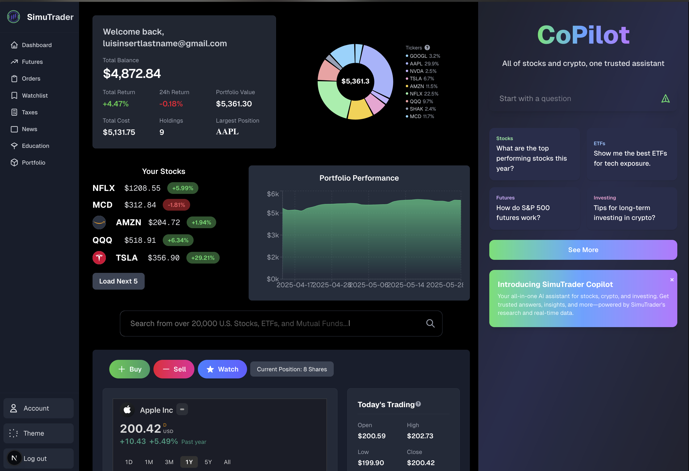

# SimuTrader AI - All of stocks and crypto, your trusted lcoal simulator

**SimuTrader AI** is a fully local, real-time trading simulator for exploring markets, portfolio strategy, and AI-assisted investing. Built to be modern, educational, and completely free of ads or paywalls.

---

## Features

- Simulates trading across 30,000+ equities (stocks, ETFs, mutual funds) and 2,000+ cryptocurrencies
- Built-in support for futures, crypto wallet tracking, and DRIP investing and more
- Integrated RAG (Retrieval-Augmented Generation) system using GPT-4o and Claude 3.5 to respond to natural language queries and execute simulated trades
- Automated risk management: stop-losses, portfolio rebalancing, and diversification metrics
- Realistic tax logic, P&L tracking, and capital gains simulation
- Live sentiment analysis and news insights for individual equities and sectors
- Local multi-user support — multiple users can manage their own portfolios on the same machine
- Uses free-tier API services (Alpha Vantage, CoinGecko, etc.)
- Info bubbles and Learn about sections for everything every term (P/E Ratio, Market Cap etc) so if you don't know, now you know and can learn hands on

---

## Why I Built This

Most trading simulators are either too basic, filled with ads, or locked behind paywalls. I built SimuTrader AI for anyone who wants to explore real-world trading logic, get curious about investing, and learn through experimentation — all without needing to trust a hosted service or sign up for yet another email list.

This app runs entirely on your machine, is free to modify, and offers a clean, modern experience for traders, students, and tinkerers.

---

## Getting Started

Clone the repository:

git clone https://github.com/suislanchez/stock-sim-app.git
cd stock-sim-app

Install dependencies:

npm install

To run in development mode (editable):

npm run dev

To build for production:

npm run build

To start in production mode:

npm run start

This app uses free APIs for single-user local simulation and stores data locally. Say goodbye to ads, spam, or limitations — just run it yourself and learn how markets work.

⸻

Tech Stack
	•	Frontend: React, Tailwind CSS
	•	Backend: Node.js, Express
	•	AI / RAG: GPT-4o, Claude 3.5, Retrieval-Augmented Generation pipeline
	•	Data Sources: Alpha Vantage, CoinGecko, Financial News APIs
	•	Storage: Local JSON, IndexedDB
	•	Authentication: Local multi-user login

⸻

License

MIT License — open to use, modification, and learning.

---

## FAQ

### Who is this for?

SimuTrader AI is built for **young adults, students, and beginners** who are curious about investing but don’t want to dive into professional platforms just yet. If you’re looking to dip your toes into trading with a **clean interface**, **AI-powered insights**, and **no ads or signup friction**, this app is for you.

---

### Do I need any trading or coding experience?

Nope. You don’t need to know anything about real-world trading or how to code. The interface is designed to be simple and intuitive, and the built-in AI assistant can help you understand terms, suggest trades, and analyze portfolios.

---

### Does this use real money or connect to real brokerages?

No. This is a **fully simulated** environment. All trades are virtual, and no real money is involved. It’s a sandbox for learning and experimenting with no financial risk.

---

### What makes this different from other simulators?

- It runs **locally** — your data stays on your machine.
- There are **no ads**, paywalls, or email lists.
- It includes a **built-in AI assistant** to guide you and answer any trading questions.
- You get access to **30,000+ equities** and **2,000+ cryptocurrencies**, which is much broader than most free simulators.
- Designed for **exploration**, not pressure — learn at your own pace.

---

### Can I use this to learn technical concepts?

Yes. The AI can help explain trading strategies, portfolio metrics, and financial terms. You’ll also gain exposure to concepts like stop-loss orders, diversification, tax-aware investing, and sentiment analysis — all without needing a finance degree.

---

### Is this a finished product?

It’s an ongoing project. You’re welcome to fork it, suggest features, or customize it however you want. Contributions are encouraged.

---

### What data sources does it use?

SimuTrader AI uses **free-tier APIs** like:
- [Alpha Vantage](https://www.alphavantage.co/)
- [CoinGecko](https://www.coingecko.com/)
- Financial news APIs for real-time sentiment

You don’t need paid accounts — everything works out of the box for personal use.

---

⸻

Contributions

PRs and feedback are welcome. If you’re building something similar or want to add features, feel free to fork or reach out.

Let me know if you want a hosted preview image (for better markdown rendering on GitHub), or if you want help setting up `.env` configs or API key instructions next.
